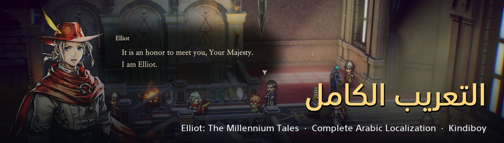
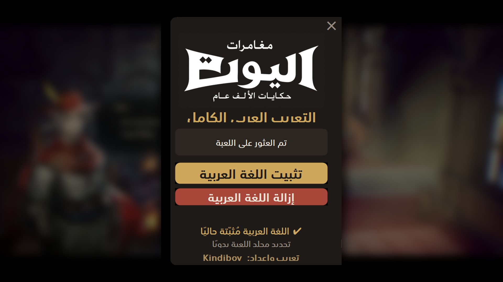

<h1 align="center">The Adventures of Elliot — التعريب الكامل</h1>

Complete Arabic localization for <b>The Adventures of Elliot: The Millennium Tales</b> (Steam) · تعريب كامل للعبة

  <a href="https://github.com/faisalkindi/Elliot-Arabic/releases/latest/download/Elliot_Arabic_Installer.zip"><b>⬇ تحميل المثبّت / Download installer</b></a>
  &nbsp;·&nbsp;
  <a href="https://github.com/faisalkindi/Elliot-Arabic/releases">كل الإصدارات / All releases</a>
  &nbsp;·&nbsp;
  <a href="https://ko-fi.com/kindiboy">☕ Ko-fi</a>

---

## العربية

**ماذا يعرّب؟** كل نصوص اللعبة — 16,910 مدخلًا، منها 16,340 بالعربية (96.6%؛ الباقي أرقام وأسماء لاتينية تُترك عمدًا) — مترجمةً **عن النصّ الياباني الأصلي** لا عن الإنجليزية: الحوارات، القصة الرئيسية والجانبية، القوائم، الأصناف، المهارات، والدروس التعليمية.

**المميزات**
- واجهة من اليمين إلى اليسار في كامل اللعبة، مع محاذاة يمينية لنوافذ الحوار والقوائم.
- خطّ عربيّ واضح (SST Arabic) يحلّ محلّ خطوط اللعبة اللاتينية.
- **شعار اللعبة نفسه بالعربية** في الشاشة الرئيسية.
- مصطلحات موحّدة عبر اللعبة كلها بمسرد مُراجَع.
- مثبّت بنقرة واحدة، مع إزالة كاملة تعيد اللعبة إلى أصلها متى شئت.

**التثبيت**
1. أغلق اللعبة تمامًا.
2. حمّل `Elliot_Arabic_Installer.zip` من الرابط أعلاه وفكّ الضغط.
3. شغّل `Elliot Arabic Installer.exe` — يكتشف مجلد اللعبة من Steam تلقائيًا (أو حدّده يدويًا) — ثم اضغط زرّ التثبيت.
4. داخل اللعبة: الإعدادات ← اللغة ← اختر «العربية» (تظهر مكان «Italiano»).

يحتاج المثبّت إلى نحو 8 جيجابايت مساحة مؤقتة أثناء التثبيت (يعيد بناء ملف اللعبة الأساسي محليًّا)، وصلاحيات مسؤول إن كانت اللعبة داخل Program Files.

**الإزالة**: شغّل المثبّت مرة أخرى واضغط زرّ الإزالة — يستعيد الملف الأصلي من النسخة الاحتياطية ويحذف ملفات التعريب.

## English

**What it covers.** Every string in the game — 16,910 entries, 16,340 of them Arabic (96.6%; the rest are numbers and Latin product names left intentionally) — translated **from the original Japanese script**, not from English: dialogue, main and side story, menus, items, skills and tutorials.

**Features**
- Full right-to-left interface, with right-aligned dialogue windows and menus.
- A clear Arabic font (SST Arabic) replacing the game's Latin faces.
- **The title-screen logo itself is in Arabic.**
- Consistent terminology via a curated glossary.
- One-click install, fully reversible uninstall.

**Install**
1. Close the game completely.
2. Download `Elliot_Arabic_Installer.zip` above and unzip it.
3. Run `Elliot Arabic Installer.exe`; it finds the Steam install automatically (or pick the folder), then click the install button.
4. In game: Settings → Language → «العربية» (it appears where «Italiano» was).

The installer needs about 8 GB of temporary space while installing (it rebuilds the game's base pak locally), and admin rights if the game is under Program Files.

**Uninstall**: run the installer again and click the uninstall button — it restores the original pak from its backup and removes the added files.

## Screenshots

## Notes

- There is no manual-install option: the mod rebuilds the game's encrypted base pak on your machine, so the installer is required. Nothing from the game is redistributed.
- Arabic occupies the Italian language slot; Italian is unavailable while the mod is installed (uninstall restores it).
- The original `Elliot-Windows.pak` is kept as `Elliot-Windows.pak.arabic_backup` next to it.
- Compatibility: a game update that changes `Elliot-Windows.pak` will require an updated release; other mods that rebuild the base pak or replace the same fonts/widgets will conflict.
- Font: SST Arabic, used for non-commercial purposes only.
- Report any typo or mistranslation in [Issues](https://github.com/faisalkindi/Elliot-Arabic/issues).
- Contributors: see [`PIPELINE.md`](PIPELINE.md) for how the corpus, translation, fonts, widgets and installer are built.

تعريب وإعداد: <b>Kindiboy</b>

